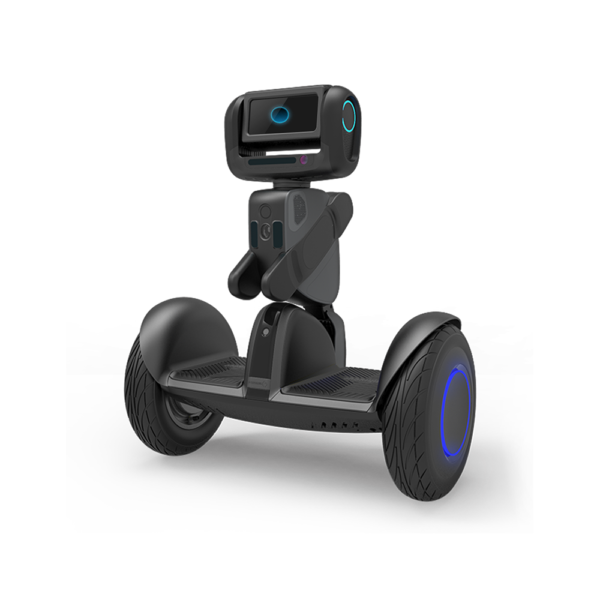

# ROS Packages Summary 

We present a brief explanation of all ROS packages we use for the **Autonomous Driving Pipeline**. We remind all users that this pipeline is designed to be flexible, and this means that modifying algorithms inside packages should not affect to the robustness of the structure. 

## Loomo

In this package, the user can change the main parameters of the pipeline. It includes the launch file that enables running all nodes at the same time. 

In this project, we used a Loomo Segway robot. Anyway, the structure could be implemented in other autonomous vehicles.

## Perception

The main goal of the package is to detect objects, animals or humans (depending on the detector used) inside raw images that come from the robot, and send bounding boxes to the loomo. 

We implement a simple **Minion** images detector and a complex human detector, called **Openpifpaf**.

## State Estimation

Using estimation algorithms, the state can be acquired in a more accurate way than the sensor's data. We also give the possibility of storing a map that contains all previous observations with the last observation.

**Extended Kalman Filters** (with kinematic model) and **Data Assotiation** (mapping) are included inside the package.

## Prediction

Inside this package, we predict the future positions of the detections, depending on their motion during the last frames. The user can change the predictor algorithm depending on the requirements.

We include simple **Linear Predictor** and **TrajNet++** in the pipeline.

## Path Planning

The main goal is to design a path for the mobile robot in order to avoid object collision, to follow a person, etc. 

In this project we use **Prediction RRT*** to avoid object collision going from a start point to a goal, considering possible motion of the observations.

## Control

In the Control package, we design an algorithm to follow the previosly calculated desired path. 

We implemented a **Model Predictive Control** with a kinematic model.

## Message Types

It contains all types of messages for the different topics we need for the pipeline.

## Visualization

Finally, we visualize the most essential ROS topics. 

