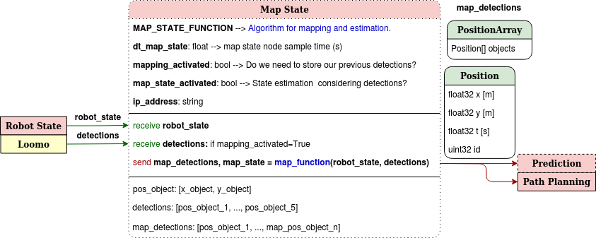

# State Estimation

## robot_state.py

<center>


</center>

We offer two different ways of estimating the autonomous vehicle's state: 

* **Initial Calibration (Default)** 
 
Directly based on IMU data from the state variables. It includes an initial calibration.

``` python 
new_states = IMU_data.state_with_initial_calibration(initial_states, states)
```
<p align="center">

</p>

* **Kalman Filtering** 

Comparing the model of the vehicle with the sensor's data in order to obtain a more reliable estimation. First, the initial calibration is required. Designed by EPFL Racing Team.

<p align="center">

</p>

``` python 
states = IMU_data.state_with_initial_calibration(initial_states, states)
new_states = estimator.kalman(states)
```

## map_state.py

<center>



</center>

It is an optional algorithm to store the previous detections. It only runs if ```mapping_activated``` in loomo.launch is set to:

```html
<param name="mapping_activated" value="True" />
``` 

* **SLAM** 

First, we need to configure the sensors' parameters used for mapping.

``` python 
slam = SLAM.SlamConfiguration(range_sensor=max_range, error_sensor=max_error)
```

Where ```max_range``` is the maximum distance, in which the depth sensor can detect an obstacle, and ```max_error``` is the maximum distance error that the depth sensor has. 

Another way to estimate the vehicle's state could be generating a map with previous detections, actual detections and other sensors' information. It could estimate with better accuracy than kalman fliters. It has not been implemented already, but the algorithm is prepared for it. If used, ```map_state_activated``` in loomo.launch should be:

```html
<param name="map_state_activated" value="True" />
``` 

This state estimation using SLAM should be built. In addition, we offer an algorithm for assotiating previous and current data and generate a map with all observations.

```python 
map_total, map_state = slam.mapping(state, list_positions)
```


